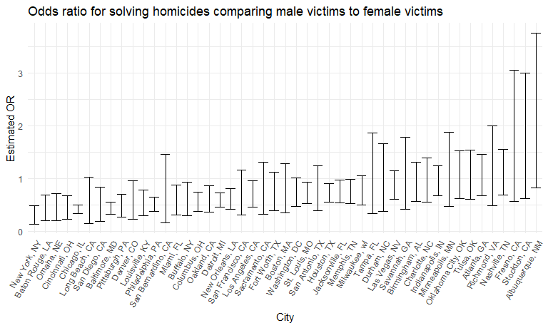

Solutions for Homework 6
================
Jiajun Tao
2022-11-29

### Problem 1

First, we download the data.

``` r
weather_df = 
  rnoaa::meteo_pull_monitors(
    c("USW00094728"),
    var = c("PRCP", "TMIN", "TMAX"), 
    date_min = "2017-01-01",
    date_max = "2017-12-31") %>%
  mutate(
    name = recode(id, USW00094728 = "CentralPark_NY"),
    tmin = tmin / 10,
    tmax = tmax / 10) %>%
  select(name, id, everything())
```

### Problem 2

First, we import the data.

``` r
homicides_df = read_csv("data/homicide-data.csv") 

homicides_df
```

    ## # A tibble: 52,179 × 12
    ##    uid   repor…¹ victi…² victi…³ victi…⁴ victi…⁵ victi…⁶ city  state   lat   lon
    ##    <chr>   <dbl> <chr>   <chr>   <chr>   <chr>   <chr>   <chr> <chr> <dbl> <dbl>
    ##  1 Alb-…  2.01e7 GARCIA  JUAN    Hispan… 78      Male    Albu… NM     35.1 -107.
    ##  2 Alb-…  2.01e7 MONTOYA CAMERON Hispan… 17      Male    Albu… NM     35.1 -107.
    ##  3 Alb-…  2.01e7 SATTER… VIVIANA White   15      Female  Albu… NM     35.1 -107.
    ##  4 Alb-…  2.01e7 MENDIO… CARLOS  Hispan… 32      Male    Albu… NM     35.1 -107.
    ##  5 Alb-…  2.01e7 MULA    VIVIAN  White   72      Female  Albu… NM     35.1 -107.
    ##  6 Alb-…  2.01e7 BOOK    GERALD… White   91      Female  Albu… NM     35.2 -107.
    ##  7 Alb-…  2.01e7 MALDON… DAVID   Hispan… 52      Male    Albu… NM     35.1 -107.
    ##  8 Alb-…  2.01e7 MALDON… CONNIE  Hispan… 52      Female  Albu… NM     35.1 -107.
    ##  9 Alb-…  2.01e7 MARTIN… GUSTAVO White   56      Male    Albu… NM     35.1 -107.
    ## 10 Alb-…  2.01e7 HERRERA ISRAEL  Hispan… 43      Male    Albu… NM     35.1 -107.
    ## # … with 52,169 more rows, 1 more variable: disposition <chr>, and abbreviated
    ## #   variable names ¹​reported_date, ²​victim_last, ³​victim_first, ⁴​victim_race,
    ## #   ⁵​victim_age, ⁶​victim_sex

Then we created a `city_state` variable, and a binary variable
indicating whether the homicide is solved. Omit cities Dallas, TX;
Phoenix, AZ; and Kansas City, MO – these don’t report victim race. Also
omit Tulsa, AL – this is a data entry mistake. Limit the analysis those
for whom `victim_race` is white or black. Be sure that `victim_age` is
numeric.

``` r
homicides_df=
  homicides_df %>% 
  mutate(
    city_state = str_c(city, ", ", state),
    whether_solved = ifelse(disposition %in% c("Closed without arrest", "Open/No arrest"), 0, 1)
  ) %>% 
  filter(!city_state %in% c("Dallas, TX", "Phoenix, AZ", "Kansas City, MO", "Tulsa, AL")) %>% 
  filter(victim_race %in% c("Black", "White")) %>% 
  filter(victim_age != "Unknown") %>% 
  mutate(victim_age = as.numeric(victim_age),
         victim_sex = as.factor(victim_sex),
         victim_race = fct_relevel(victim_race,"White"))

homicides_df
```

    ## # A tibble: 39,403 × 14
    ##    uid   repor…¹ victi…² victi…³ victi…⁴ victi…⁵ victi…⁶ city  state   lat   lon
    ##    <chr>   <dbl> <chr>   <chr>   <fct>     <dbl> <fct>   <chr> <chr> <dbl> <dbl>
    ##  1 Alb-…  2.01e7 SATTER… VIVIANA White        15 Female  Albu… NM     35.1 -107.
    ##  2 Alb-…  2.01e7 MULA    VIVIAN  White        72 Female  Albu… NM     35.1 -107.
    ##  3 Alb-…  2.01e7 BOOK    GERALD… White        91 Female  Albu… NM     35.2 -107.
    ##  4 Alb-…  2.01e7 MARTIN… GUSTAVO White        56 Male    Albu… NM     35.1 -107.
    ##  5 Alb-…  2.01e7 GRAY    STEFAN… White        43 Female  Albu… NM     35.1 -107.
    ##  6 Alb-…  2.01e7 DAVID   LARRY   White        52 Male    Albu… NM     NA     NA 
    ##  7 Alb-…  2.01e7 BRITO   ELIZAB… White        22 Female  Albu… NM     35.1 -107.
    ##  8 Alb-…  2.01e7 KING    TEVION  Black        15 Male    Albu… NM     35.1 -107.
    ##  9 Alb-…  2.01e7 BOYKIN  CEDRIC  Black        25 Male    Albu… NM     35.1 -107.
    ## 10 Alb-…  2.01e7 BARRAG… MIGUEL  White        20 Male    Albu… NM     35.1 -107.
    ## # … with 39,393 more rows, 3 more variables: disposition <chr>,
    ## #   city_state <chr>, whether_solved <dbl>, and abbreviated variable names
    ## #   ¹​reported_date, ²​victim_last, ³​victim_first, ⁴​victim_race, ⁵​victim_age,
    ## #   ⁶​victim_sex

For the city of Baltimore, MD, use the `glm` function to fit a logistic
regression with resolved vs unresolved as the outcome and victim age,
sex and race as predictors. Save the output of `glm` as an R object;
apply the `broom::tidy` to this object; and obtain the estimate and
confidence interval of the adjusted odds ratio for solving homicides
comparing male victims to female victims keeping all other variables
fixed.

``` r
fit_logistic = 
  homicides_df %>% 
  filter(city == "Baltimore") %>% 
  glm(whether_solved ~ victim_age + victim_sex + victim_race, data = ., family = binomial())

fit_logistic %>% 
  broom::tidy() %>% 
  mutate(OR = exp(estimate),
         lower = exp(confint(fit_logistic)[,1]),
         upper = exp(confint(fit_logistic)[,2])) %>% 
  filter(term == "victim_sexMale") %>% 
  select(OR, lower, upper) %>% 
  knitr::kable(digits = 3)
```

|    OR | lower | upper |
|------:|------:|------:|
| 0.426 | 0.324 | 0.558 |

We can see that homicides in which the victim is male are significantly
less like to be resolved than those in which the victim is female in
Baltimore.

Now run `glm` for each of the cities in the dataset, and extract the
adjusted odds ratio (and CI) for solving homicides comparing male
victims to female victims.

``` r
logistic_function = function(demographics){
  
  logistic_fit = glm(whether_solved ~ victim_age + victim_sex + victim_race, data = demographics, family = binomial())
  
  logistic_fit %>% 
    broom::tidy() %>% 
    mutate(OR = exp(estimate),
           lower = exp(confint(logistic_fit)[,1]),
           upper = exp(confint(logistic_fit)[,2])) %>% 
    filter(term == "victim_sexMale") %>% 
    select(OR, lower, upper) 
}

logistic_df = 
  homicides_df %>% 
  select(city_state,victim_age, victim_race, victim_sex, whether_solved) %>% 
  nest(demographics = victim_age:whether_solved) %>% 
  mutate(
    logistic_fit = purrr::map(demographics, logistic_function)
  ) %>% 
  select(-demographics) %>% 
  unnest(logistic_fit)

logistic_df
```

    ## # A tibble: 47 × 4
    ##    city_state         OR lower upper
    ##    <chr>           <dbl> <dbl> <dbl>
    ##  1 Albuquerque, NM 1.77  0.825 3.76 
    ##  2 Atlanta, GA     1.00  0.680 1.46 
    ##  3 Baltimore, MD   0.426 0.324 0.558
    ##  4 Baton Rouge, LA 0.381 0.204 0.684
    ##  5 Birmingham, AL  0.870 0.571 1.31 
    ##  6 Boston, MA      0.674 0.353 1.28 
    ##  7 Buffalo, NY     0.521 0.288 0.936
    ##  8 Charlotte, NC   0.884 0.551 1.39 
    ##  9 Chicago, IL     0.410 0.336 0.501
    ## 10 Cincinnati, OH  0.400 0.231 0.667
    ## # … with 37 more rows

Finally we create a plot that shows the estimated ORs and CIs for each
city. Organize cities according to estimated OR.

``` r
logistic_df %>% 
  mutate(
    city_state = fct_reorder(city_state, OR)
  ) %>% 
  ggplot(aes(x = city_state, y = OR)) +
  geom_errorbar(aes(ymin = lower, ymax = upper)) +
  theme(axis.text.x = element_text(angle = 60, hjust = 1)) +
  labs(
    title = "Odds ratio for solving homicides comparing male victims to female victims",
    x = "City",
    y = "Estimated OR"
  )
```


