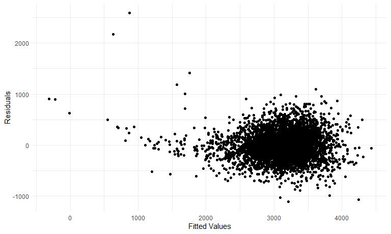
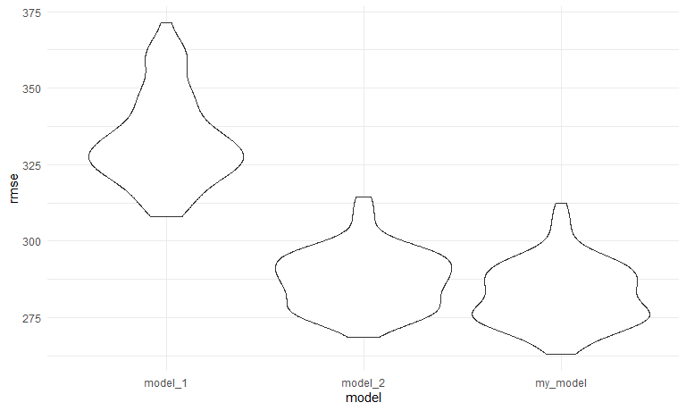

Solutions for Homework 6
================
Jiajun Tao
2022-11-29

### Problem 1

First, we download the data.

``` r
weather_df = 
  rnoaa::meteo_pull_monitors(
    c("USW00094728"),
    var = c("PRCP", "TMIN", "TMAX"), 
    date_min = "2017-01-01",
    date_max = "2017-12-31") %>%
  mutate(
    name = recode(id, USW00094728 = "CentralPark_NY"),
    tmin = tmin / 10,
    tmax = tmax / 10) %>%
  select(name, id, everything())
```

### Problem 2

First, we import the data.

``` r
homicides_df = read_csv("data/homicide-data.csv") 

homicides_df
```

    ## # A tibble: 52,179 × 12
    ##    uid   repor…¹ victi…² victi…³ victi…⁴ victi…⁵ victi…⁶ city  state   lat   lon
    ##    <chr>   <dbl> <chr>   <chr>   <chr>   <chr>   <chr>   <chr> <chr> <dbl> <dbl>
    ##  1 Alb-…  2.01e7 GARCIA  JUAN    Hispan… 78      Male    Albu… NM     35.1 -107.
    ##  2 Alb-…  2.01e7 MONTOYA CAMERON Hispan… 17      Male    Albu… NM     35.1 -107.
    ##  3 Alb-…  2.01e7 SATTER… VIVIANA White   15      Female  Albu… NM     35.1 -107.
    ##  4 Alb-…  2.01e7 MENDIO… CARLOS  Hispan… 32      Male    Albu… NM     35.1 -107.
    ##  5 Alb-…  2.01e7 MULA    VIVIAN  White   72      Female  Albu… NM     35.1 -107.
    ##  6 Alb-…  2.01e7 BOOK    GERALD… White   91      Female  Albu… NM     35.2 -107.
    ##  7 Alb-…  2.01e7 MALDON… DAVID   Hispan… 52      Male    Albu… NM     35.1 -107.
    ##  8 Alb-…  2.01e7 MALDON… CONNIE  Hispan… 52      Female  Albu… NM     35.1 -107.
    ##  9 Alb-…  2.01e7 MARTIN… GUSTAVO White   56      Male    Albu… NM     35.1 -107.
    ## 10 Alb-…  2.01e7 HERRERA ISRAEL  Hispan… 43      Male    Albu… NM     35.1 -107.
    ## # … with 52,169 more rows, 1 more variable: disposition <chr>, and abbreviated
    ## #   variable names ¹​reported_date, ²​victim_last, ³​victim_first, ⁴​victim_race,
    ## #   ⁵​victim_age, ⁶​victim_sex

Then we created a `city_state` variable, and a binary variable
indicating whether the homicide is solved. Omit cities Dallas, TX;
Phoenix, AZ; and Kansas City, MO – these don’t report victim race. Also
omit Tulsa, AL – this is a data entry mistake. Limit the analysis those
for whom `victim_race` is white or black. Be sure that `victim_age` is
numeric.

``` r
homicides_df=
  homicides_df %>% 
  mutate(
    city_state = str_c(city, ", ", state),
    whether_solved = ifelse(disposition %in% c("Closed without arrest", "Open/No arrest"), 0, 1)
  ) %>% 
  filter(!city_state %in% c("Dallas, TX", "Phoenix, AZ", "Kansas City, MO", "Tulsa, AL")) %>% 
  filter(victim_race %in% c("Black", "White")) %>% 
  filter(victim_age != "Unknown") %>% 
  mutate(victim_age = as.numeric(victim_age),
         victim_sex = as.factor(victim_sex),
         victim_race = fct_relevel(victim_race,"White"))

homicides_df
```

    ## # A tibble: 39,403 × 14
    ##    uid   repor…¹ victi…² victi…³ victi…⁴ victi…⁵ victi…⁶ city  state   lat   lon
    ##    <chr>   <dbl> <chr>   <chr>   <fct>     <dbl> <fct>   <chr> <chr> <dbl> <dbl>
    ##  1 Alb-…  2.01e7 SATTER… VIVIANA White        15 Female  Albu… NM     35.1 -107.
    ##  2 Alb-…  2.01e7 MULA    VIVIAN  White        72 Female  Albu… NM     35.1 -107.
    ##  3 Alb-…  2.01e7 BOOK    GERALD… White        91 Female  Albu… NM     35.2 -107.
    ##  4 Alb-…  2.01e7 MARTIN… GUSTAVO White        56 Male    Albu… NM     35.1 -107.
    ##  5 Alb-…  2.01e7 GRAY    STEFAN… White        43 Female  Albu… NM     35.1 -107.
    ##  6 Alb-…  2.01e7 DAVID   LARRY   White        52 Male    Albu… NM     NA     NA 
    ##  7 Alb-…  2.01e7 BRITO   ELIZAB… White        22 Female  Albu… NM     35.1 -107.
    ##  8 Alb-…  2.01e7 KING    TEVION  Black        15 Male    Albu… NM     35.1 -107.
    ##  9 Alb-…  2.01e7 BOYKIN  CEDRIC  Black        25 Male    Albu… NM     35.1 -107.
    ## 10 Alb-…  2.01e7 BARRAG… MIGUEL  White        20 Male    Albu… NM     35.1 -107.
    ## # … with 39,393 more rows, 3 more variables: disposition <chr>,
    ## #   city_state <chr>, whether_solved <dbl>, and abbreviated variable names
    ## #   ¹​reported_date, ²​victim_last, ³​victim_first, ⁴​victim_race, ⁵​victim_age,
    ## #   ⁶​victim_sex

For the city of Baltimore, MD, use the `glm` function to fit a logistic
regression with resolved vs unresolved as the outcome and victim age,
sex and race as predictors. Save the output of `glm` as an R object;
apply the `broom::tidy` to this object; and obtain the estimate and
confidence interval of the adjusted odds ratio for solving homicides
comparing male victims to female victims keeping all other variables
fixed.

``` r
fit_logistic = 
  homicides_df %>% 
  filter(city == "Baltimore") %>% 
  glm(whether_solved ~ victim_age + victim_sex + victim_race, data = ., family = binomial())

fit_logistic %>% 
  broom::tidy() %>% 
  mutate(OR = exp(estimate),
         lower = exp(confint(fit_logistic)[,1]),
         upper = exp(confint(fit_logistic)[,2])) %>% 
  filter(term == "victim_sexMale") %>% 
  select(OR, lower, upper) %>% 
  knitr::kable(digits = 3)
```

|    OR | lower | upper |
|------:|------:|------:|
| 0.426 | 0.324 | 0.558 |

We can see that homicides in which the victim is male are significantly
less like to be resolved than those in which the victim is female in
Baltimore.

Now run `glm` for each of the cities in the dataset, and extract the
adjusted odds ratio (and CI) for solving homicides comparing male
victims to female victims.

``` r
logistic_function = function(demographics){
  
  logistic_fit = glm(whether_solved ~ victim_age + victim_sex + victim_race, data = demographics, family = binomial())
  
  logistic_fit %>% 
    broom::tidy() %>% 
    mutate(OR = exp(estimate),
           lower = exp(confint(logistic_fit)[,1]),
           upper = exp(confint(logistic_fit)[,2])) %>% 
    filter(term == "victim_sexMale") %>% 
    select(OR, lower, upper) 
}

logistic_df = 
  homicides_df %>% 
  select(city_state,victim_age, victim_race, victim_sex, whether_solved) %>% 
  nest(demographics = victim_age:whether_solved) %>% 
  mutate(
    logistic_fit = purrr::map(demographics, logistic_function)
  ) %>% 
  select(-demographics) %>% 
  unnest(logistic_fit)

logistic_df
```

    ## # A tibble: 47 × 4
    ##    city_state         OR lower upper
    ##    <chr>           <dbl> <dbl> <dbl>
    ##  1 Albuquerque, NM 1.77  0.825 3.76 
    ##  2 Atlanta, GA     1.00  0.680 1.46 
    ##  3 Baltimore, MD   0.426 0.324 0.558
    ##  4 Baton Rouge, LA 0.381 0.204 0.684
    ##  5 Birmingham, AL  0.870 0.571 1.31 
    ##  6 Boston, MA      0.674 0.353 1.28 
    ##  7 Buffalo, NY     0.521 0.288 0.936
    ##  8 Charlotte, NC   0.884 0.551 1.39 
    ##  9 Chicago, IL     0.410 0.336 0.501
    ## 10 Cincinnati, OH  0.400 0.231 0.667
    ## # … with 37 more rows

Finally we create a plot that shows the estimated ORs and CIs for each
city. Organize cities according to estimated OR.

``` r
logistic_df %>% 
  mutate(
    city_state = fct_reorder(city_state, OR)
  ) %>% 
  ggplot(aes(x = city_state, y = OR)) +
  geom_errorbar(aes(ymin = lower, ymax = upper)) +
  theme(axis.text.x = element_text(angle = 60, hjust = 1)) +
  labs(
    title = "Odds ratio for solving homicides comparing male victims to female victims",
    x = "City",
    y = "Estimated OR"
  )
```


The estimated OR varies among the cities,the lowest OR is in New York,
which indicates that in New York, homicides in which the victim is male
are significantly less like to be resolved than those in which the
victim is female. However, the highest OR is in Albuquerque, which
indicates that homicides in which the victim is male are more likely to
be resolved than those in which the victim is female. As we can see some
intervals are really wide because the sample size is quite small. So we
should investigate more before jumping to conclusion.

### Problem 3

First, we load the data.

``` r
bw_df = 
  read_csv("data/birthweight.csv") %>% 
  mutate(
     babysex = factor(babysex,levels = c(1, 2),labels = c("Male", "Female")),
         frace = factor(frace, levels = c(1, 2, 3, 4, 8, 9),labels = c("White", "Black", "Asian", "Puerto Rican", "Other", "Unknown")), 
         malform = factor(malform,levels = c(0, 1),labels = c("Absent", "Present")),
         mrace = factor(mrace,levels = c(1, 2, 3, 4, 8),labels = c("White", "Black", "Asian", "Puerto Rican", "Other"))
  ) %>% 
  na.omit() 

bw_df
```

    ## # A tibble: 4,342 × 20
    ##    babysex bhead blength   bwt delwt fincome frace gaweeks malform menarche
    ##    <fct>   <dbl>   <dbl> <dbl> <dbl>   <dbl> <fct>   <dbl> <fct>      <dbl>
    ##  1 Female     34      51  3629   177      35 White    39.9 Absent        13
    ##  2 Male       34      48  3062   156      65 Black    25.9 Absent        14
    ##  3 Female     36      50  3345   148      85 White    39.9 Absent        12
    ##  4 Male       34      52  3062   157      55 White    40   Absent        14
    ##  5 Female     34      52  3374   156       5 White    41.6 Absent        13
    ##  6 Male       33      52  3374   129      55 White    40.7 Absent        12
    ##  7 Female     33      46  2523   126      96 Black    40.3 Absent        14
    ##  8 Female     33      49  2778   140       5 White    37.4 Absent        12
    ##  9 Male       36      52  3515   146      85 White    40.3 Absent        11
    ## 10 Male       33      50  3459   169      75 Black    40.7 Absent        12
    ## # … with 4,332 more rows, and 10 more variables: mheight <dbl>, momage <dbl>,
    ## #   mrace <fct>, parity <dbl>, pnumlbw <dbl>, pnumsga <dbl>, ppbmi <dbl>,
    ## #   ppwt <dbl>, smoken <dbl>, wtgain <dbl>

After skimming the data, I propose that `babysex`, `bhead`, `blength`,
`gaweeks`, `malform`, `smoken`, `wtgain` would contribute most to the
`bwt`. I think a baby’s characteristics would affect his weight, so I
put in all variables about babies. Then I think gestational age, mother
smoking, and mother’s gained weight are also important. Finally, I think
malformation could influence a baby’s weight. So it is my first model.

``` r
fit_model = lm(bwt ~ babysex + bhead + blength + gaweeks + malform + smoken + wtgain, data = bw_df)

summary(fit_model)
```

    ## 
    ## Call:
    ## lm(formula = bwt ~ babysex + bhead + blength + gaweeks + malform + 
    ##     smoken + wtgain, data = bw_df)
    ## 
    ## Residuals:
    ##     Min      1Q  Median      3Q     Max 
    ## -1109.2  -189.9    -9.3   173.4  2586.4 
    ## 
    ## Coefficients:
    ##                  Estimate Std. Error t value Pr(>|t|)    
    ## (Intercept)    -6134.1262    98.0683 -62.550  < 2e-16 ***
    ## babysexFemale     32.7439     8.7661   3.735 0.000190 ***
    ## bhead            138.4352     3.5421  39.083  < 2e-16 ***
    ## blength           79.8464     2.0725  38.527  < 2e-16 ***
    ## gaweeks           13.4978     1.5064   8.960  < 2e-16 ***
    ## malformPresent    30.3884    73.2929   0.415 0.678444    
    ## smoken            -1.9638     0.5838  -3.364 0.000776 ***
    ## wtgain             3.5145     0.4027   8.727  < 2e-16 ***
    ## ---
    ## Signif. codes:  0 '***' 0.001 '**' 0.01 '*' 0.05 '.' 0.1 ' ' 1
    ## 
    ## Residual standard error: 283 on 4334 degrees of freedom
    ## Multiple R-squared:  0.6951, Adjusted R-squared:  0.6947 
    ## F-statistic:  1412 on 7 and 4334 DF,  p-value: < 2.2e-16

We can see that `malform` variable is not that statistically
significant, so we would like to remove it.

``` r
fit_model = lm(bwt ~ babysex + bhead + blength + gaweeks + smoken + wtgain, data = bw_df)

summary(fit_model)
```

    ## 
    ## Call:
    ## lm(formula = bwt ~ babysex + bhead + blength + gaweeks + smoken + 
    ##     wtgain, data = bw_df)
    ## 
    ## Residuals:
    ##      Min       1Q   Median       3Q      Max 
    ## -1109.32  -189.56    -9.54   173.30  2585.99 
    ## 
    ## Coefficients:
    ##                 Estimate Std. Error t value Pr(>|t|)    
    ## (Intercept)   -6133.7544    98.0549 -62.554  < 2e-16 ***
    ## babysexFemale    32.6864     8.7641   3.730 0.000194 ***
    ## bhead           138.4473     3.5416  39.092  < 2e-16 ***
    ## blength          79.8340     2.0721  38.529  < 2e-16 ***
    ## gaweeks          13.4932     1.5062   8.958  < 2e-16 ***
    ## smoken           -1.9562     0.5835  -3.353 0.000808 ***
    ## wtgain            3.5198     0.4025   8.745  < 2e-16 ***
    ## ---
    ## Signif. codes:  0 '***' 0.001 '**' 0.01 '*' 0.05 '.' 0.1 ' ' 1
    ## 
    ## Residual standard error: 283 on 4335 degrees of freedom
    ## Multiple R-squared:  0.6951, Adjusted R-squared:  0.6947 
    ## F-statistic:  1647 on 6 and 4335 DF,  p-value: < 2.2e-16

Then it looks great. We plot residuals against fitted values.

``` r
bw_df %>% 
  add_residuals(fit_model) %>% 
  add_predictions(fit_model) %>% 
  ggplot(aes(x = pred, y = resid)) +
  geom_point() +
  labs(
    x = "Fitted Values",
    y = "Residuals"
  )
```



The residuals are around 0, and the fitted values are around 3000. There
are several extreme points, but that does not matter.

Then we compare the models using cross validation.

``` r
cv_df = 
  crossv_mc(bw_df, 100) %>% 
  mutate(
    train = map(train, as_tibble),
    test = map(test, as_tibble)
  )

cv_df = 
  cv_df %>% 
  mutate(
    model_1  = map(.x = train, ~lm(bwt ~ blength + gaweeks, data = bw_df)),
    model_2  = map(.x = train, ~lm(bwt ~ bhead + blength + babysex + bhead*blength + blength*babysex + bhead*babysex + bhead*blength*babysex, data = bw_df)),
    my_model  = map(.x = train, ~lm(bwt ~ babysex + bhead + blength + gaweeks + smoken + wtgain, data = bw_df))) %>% 
  mutate(
    rmse_model_1 = map2_dbl(model_1, test, ~rmse(model = .x, data = .y)),
    rmse_model_2 = map2_dbl(model_2, test, ~rmse(model = .x, data = .y)),
    rmse_my_model = map2_dbl(my_model, test, ~rmse(model = .x, data = .y)))
```

Finally, we make a plot to show the distribution of RMSE

``` r
cv_df %>% 
  select(starts_with("rmse")) %>% 
  pivot_longer(
    everything(),
    names_to = "model",
    values_to = "rmse",
    names_prefix = "rmse_"
  ) %>% 
  ggplot(aes(x = model, y = rmse)) +
  geom_violin()
```



As we can see, my model is slightly better than model 2, and might be
the best among the three models.
