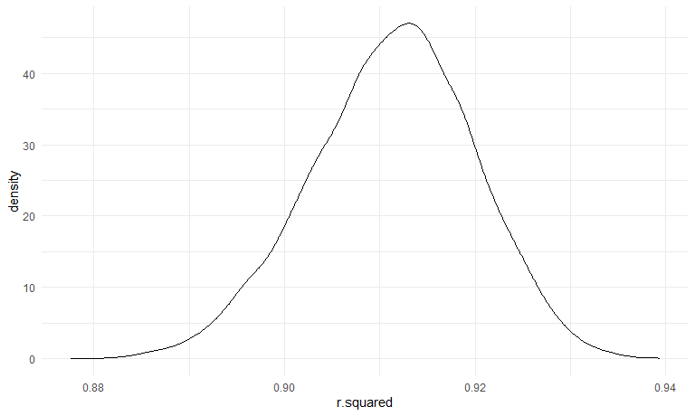
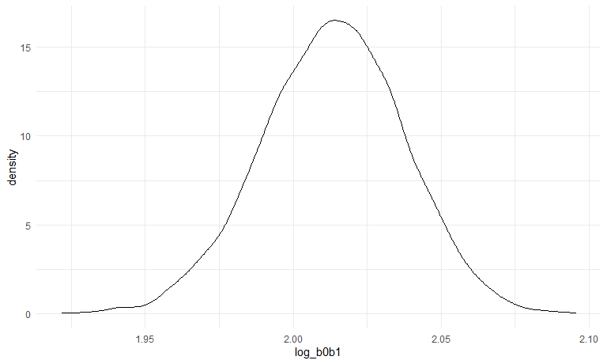

Solutions for Homework 6
================
Jiajun Tao
2022-11-29

### Problem 1

First, we download the data.

``` r
weather_df = 
  rnoaa::meteo_pull_monitors(
    c("USW00094728"),
    var = c("PRCP", "TMIN", "TMAX"), 
    date_min = "2017-01-01",
    date_max = "2017-12-31") %>%
  mutate(
    name = recode(id, USW00094728 = "CentralPark_NY"),
    tmin = tmin / 10,
    tmax = tmax / 10) %>%
  select(name, id, everything())
```

Then we use bootstrap to draw the samples, and use `bloom::glance` or
`bloom::tidy` to extract the value.

``` r
result_df =
  weather_df %>% 
  modelr::bootstrap(n = 5000) %>% 
  mutate(
    model = map(strap, ~lm(tmax ~ tmin, data = .x)),
    r_results = map(model, broom::glance),
    beta_results = map(model, broom::tidy)
  ) 
```

We make a plot to show the distribution of r_squared.

``` r
result_df %>% 
  unnest(r_results) %>% 
  ggplot(aes(x = r.squared)) + geom_density()
```



As we can see in the plot, it’s approximately normal. The mean for
$\hat{r}^2$ is about 0.91.

Then we want to take the 2.5% and 97.5% quantiles of estimates to
construct a 95% confidence interval.

``` r
result_df %>% 
  unnest(r_results) %>%
  select(r.squared) %>% 
  summarise(
    lower = quantile(r.squared, .025),
    upper = quantile(r.squared, .975)
  ) %>% 
  knitr::kable(caption = "95% CI for R-squared", digits = 3)
```

| lower | upper |
|------:|------:|
| 0.894 | 0.927 |

95% CI for R-squared

We make a plot to show the distribution for $\log(\beta_0 * \beta1)$.

``` r
beta_df =
  result_df %>% 
  unnest(beta_results) %>% 
  select(.id, term, estimate) %>% 
  pivot_wider(
    names_from = term,
    values_from = estimate
  ) %>% 
  rename(beta_0 = `(Intercept)`, beta_1 = tmin) %>% 
  mutate(log_b0b1 = log(beta_0 * beta_1))

ggplot(beta_df, aes(x = log_b0b1)) + geom_density()
```



Also it’s approximately normal. The mean for $\hat{r}^2$ is about 2.00.

And we take the 2.5% and 97.5% quantiles of estimates to construct a 95%
confidence interval.

``` r
beta_df %>% 
  summarise(
    lower = quantile(log_b0b1, .025),
    upper = quantile(log_b0b1, .975)
  ) %>% 
  knitr::kable(caption = "95% CI for log_b0b1", digits = 3)
```

| lower | upper |
|------:|------:|
| 1.964 |  2.06 |

95% CI for log_b0b1

### Problem 2

First, we import the data.

``` r
homicides_df = read_csv("data/homicide-data.csv") 

homicides_df
```

    ## # A tibble: 52,179 × 12
    ##    uid   repor…¹ victi…² victi…³ victi…⁴ victi…⁵ victi…⁶ city  state   lat   lon
    ##    <chr>   <dbl> <chr>   <chr>   <chr>   <chr>   <chr>   <chr> <chr> <dbl> <dbl>
    ##  1 Alb-…  2.01e7 GARCIA  JUAN    Hispan… 78      Male    Albu… NM     35.1 -107.
    ##  2 Alb-…  2.01e7 MONTOYA CAMERON Hispan… 17      Male    Albu… NM     35.1 -107.
    ##  3 Alb-…  2.01e7 SATTER… VIVIANA White   15      Female  Albu… NM     35.1 -107.
    ##  4 Alb-…  2.01e7 MENDIO… CARLOS  Hispan… 32      Male    Albu… NM     35.1 -107.
    ##  5 Alb-…  2.01e7 MULA    VIVIAN  White   72      Female  Albu… NM     35.1 -107.
    ##  6 Alb-…  2.01e7 BOOK    GERALD… White   91      Female  Albu… NM     35.2 -107.
    ##  7 Alb-…  2.01e7 MALDON… DAVID   Hispan… 52      Male    Albu… NM     35.1 -107.
    ##  8 Alb-…  2.01e7 MALDON… CONNIE  Hispan… 52      Female  Albu… NM     35.1 -107.
    ##  9 Alb-…  2.01e7 MARTIN… GUSTAVO White   56      Male    Albu… NM     35.1 -107.
    ## 10 Alb-…  2.01e7 HERRERA ISRAEL  Hispan… 43      Male    Albu… NM     35.1 -107.
    ## # … with 52,169 more rows, 1 more variable: disposition <chr>, and abbreviated
    ## #   variable names ¹​reported_date, ²​victim_last, ³​victim_first, ⁴​victim_race,
    ## #   ⁵​victim_age, ⁶​victim_sex

Then we created a `city_state` variable, and a binary variable
indicating whether the homicide is solved. Omit cities Dallas, TX;
Phoenix, AZ; and Kansas City, MO – these don’t report victim race. Also
omit Tulsa, AL – this is a data entry mistake. Limit the analysis those
for whom `victim_race` is white or black. Be sure that `victim_age` is
numeric.

``` r
homicides_df=
  homicides_df %>% 
  mutate(
    city_state = str_c(city, ", ", state),
    whether_solved = ifelse(disposition %in% c("Closed without arrest", "Open/No arrest"), 0, 1)
  ) %>% 
  filter(!city_state %in% c("Dallas, TX", "Phoenix, AZ", "Kansas City, MO", "Tulsa, AL")) %>% 
  filter(victim_race %in% c("Black", "White")) %>% 
  filter(victim_age != "Unknown") %>% 
  mutate(victim_age = as.numeric(victim_age),
         victim_sex = as.factor(victim_sex),
         victim_race = fct_relevel(victim_race,"White"))

homicides_df
```

    ## # A tibble: 39,403 × 14
    ##    uid   repor…¹ victi…² victi…³ victi…⁴ victi…⁵ victi…⁶ city  state   lat   lon
    ##    <chr>   <dbl> <chr>   <chr>   <fct>     <dbl> <fct>   <chr> <chr> <dbl> <dbl>
    ##  1 Alb-…  2.01e7 SATTER… VIVIANA White        15 Female  Albu… NM     35.1 -107.
    ##  2 Alb-…  2.01e7 MULA    VIVIAN  White        72 Female  Albu… NM     35.1 -107.
    ##  3 Alb-…  2.01e7 BOOK    GERALD… White        91 Female  Albu… NM     35.2 -107.
    ##  4 Alb-…  2.01e7 MARTIN… GUSTAVO White        56 Male    Albu… NM     35.1 -107.
    ##  5 Alb-…  2.01e7 GRAY    STEFAN… White        43 Female  Albu… NM     35.1 -107.
    ##  6 Alb-…  2.01e7 DAVID   LARRY   White        52 Male    Albu… NM     NA     NA 
    ##  7 Alb-…  2.01e7 BRITO   ELIZAB… White        22 Female  Albu… NM     35.1 -107.
    ##  8 Alb-…  2.01e7 KING    TEVION  Black        15 Male    Albu… NM     35.1 -107.
    ##  9 Alb-…  2.01e7 BOYKIN  CEDRIC  Black        25 Male    Albu… NM     35.1 -107.
    ## 10 Alb-…  2.01e7 BARRAG… MIGUEL  White        20 Male    Albu… NM     35.1 -107.
    ## # … with 39,393 more rows, 3 more variables: disposition <chr>,
    ## #   city_state <chr>, whether_solved <dbl>, and abbreviated variable names
    ## #   ¹​reported_date, ²​victim_last, ³​victim_first, ⁴​victim_race, ⁵​victim_age,
    ## #   ⁶​victim_sex

For the city of Baltimore, MD, use the `glm` function to fit a logistic
regression with resolved vs unresolved as the outcome and victim age,
sex and race as predictors. Save the output of `glm` as an R object;
apply the `broom::tidy` to this object; and obtain the estimate and
confidence interval of the adjusted odds ratio for solving homicides
comparing male victims to female victims keeping all other variables
fixed.

``` r
fit_logistic = 
  homicides_df %>% 
  filter(city == "Baltimore") %>% 
  glm(whether_solved ~ victim_age + victim_sex + victim_race, data = ., family = binomial())

fit_logistic %>% 
  broom::tidy() %>% 
  mutate(OR = exp(estimate),
         lower = exp(confint(fit_logistic)[,1]),
         upper = exp(confint(fit_logistic)[,2])) %>% 
  filter(term == "victim_sexMale") %>% 
  select(OR, lower, upper) %>% 
  knitr::kable(digits = 3)
```

|    OR | lower | upper |
|------:|------:|------:|
| 0.426 | 0.324 | 0.558 |

We can see that homicides in which the victim is male are significantly
less like to be resolved than those in which the victim is female in
Baltimore.

Now run `glm` for each of the cities in the dataset, and extract the
adjusted odds ratio (and CI) for solving homicides comparing male
victims to female victims.

``` r
logistic_function = function(demographics){
  
  logistic_fit = glm(whether_solved ~ victim_age + victim_sex + victim_race, data = demographics, family = binomial())
  
  logistic_fit %>% 
    broom::tidy() %>% 
    mutate(OR = exp(estimate),
           lower = exp(confint(logistic_fit)[,1]),
           upper = exp(confint(logistic_fit)[,2])) %>% 
    filter(term == "victim_sexMale") %>% 
    select(OR, lower, upper) 
}

logistic_df = 
  homicides_df %>% 
  select(city_state,victim_age, victim_race, victim_sex, whether_solved) %>% 
  nest(demographics = victim_age:whether_solved) %>% 
  mutate(
    logistic_fit = purrr::map(demographics, logistic_function)
  ) %>% 
  select(-demographics) %>% 
  unnest(logistic_fit)

logistic_df
```

    ## # A tibble: 47 × 4
    ##    city_state         OR lower upper
    ##    <chr>           <dbl> <dbl> <dbl>
    ##  1 Albuquerque, NM 1.77  0.825 3.76 
    ##  2 Atlanta, GA     1.00  0.680 1.46 
    ##  3 Baltimore, MD   0.426 0.324 0.558
    ##  4 Baton Rouge, LA 0.381 0.204 0.684
    ##  5 Birmingham, AL  0.870 0.571 1.31 
    ##  6 Boston, MA      0.674 0.353 1.28 
    ##  7 Buffalo, NY     0.521 0.288 0.936
    ##  8 Charlotte, NC   0.884 0.551 1.39 
    ##  9 Chicago, IL     0.410 0.336 0.501
    ## 10 Cincinnati, OH  0.400 0.231 0.667
    ## # … with 37 more rows

Finally we create a plot that shows the estimated ORs and CIs for each
city. Organize cities according to estimated OR.

``` r
logistic_df %>% 
  mutate(
    city_state = fct_reorder(city_state, OR)
  ) %>% 
  ggplot(aes(x = city_state, y = OR)) +
  geom_errorbar(aes(ymin = lower, ymax = upper)) +
  theme(axis.text.x = element_text(angle = 60, hjust = 1)) +
  labs(
    title = "Odds ratio for solving homicides comparing male victims to female victims",
    x = "City",
    y = "Estimated OR"
  )
```


The estimated OR varies among the cities. The lowest OR is in New York,
and the upper limit doesn’t exceed 1, which indicates that in New York,
homicides in which the victim is male are significantly less like to be
resolved than those in which the victim is female. However, the highest
OR is in Albuquerque, which indicates that homicides in which the victim
is male are more likely to be resolved than those in which the victim is
female. As we can see some confidence intervals are really wide because
the sample size is quite small. There may be some relationships between
sex and disposition, but we should investigate more before jumping to
conclusion.

### Problem 3

First, we load the data.

``` r
bw_df = 
  read_csv("data/birthweight.csv") %>% 
  mutate(
     babysex = factor(babysex,levels = c(1, 2),labels = c("Male", "Female")),
         frace = factor(frace, levels = c(1, 2, 3, 4, 8, 9),labels = c("White", "Black", "Asian", "Puerto Rican", "Other", "Unknown")), 
         malform = factor(malform,levels = c(0, 1),labels = c("Absent", "Present")),
         mrace = factor(mrace,levels = c(1, 2, 3, 4, 8),labels = c("White", "Black", "Asian", "Puerto Rican", "Other"))
  ) %>% 
  na.omit() 

bw_df
```

    ## # A tibble: 4,342 × 20
    ##    babysex bhead blength   bwt delwt fincome frace gaweeks malform menarche
    ##    <fct>   <dbl>   <dbl> <dbl> <dbl>   <dbl> <fct>   <dbl> <fct>      <dbl>
    ##  1 Female     34      51  3629   177      35 White    39.9 Absent        13
    ##  2 Male       34      48  3062   156      65 Black    25.9 Absent        14
    ##  3 Female     36      50  3345   148      85 White    39.9 Absent        12
    ##  4 Male       34      52  3062   157      55 White    40   Absent        14
    ##  5 Female     34      52  3374   156       5 White    41.6 Absent        13
    ##  6 Male       33      52  3374   129      55 White    40.7 Absent        12
    ##  7 Female     33      46  2523   126      96 Black    40.3 Absent        14
    ##  8 Female     33      49  2778   140       5 White    37.4 Absent        12
    ##  9 Male       36      52  3515   146      85 White    40.3 Absent        11
    ## 10 Male       33      50  3459   169      75 Black    40.7 Absent        12
    ## # … with 4,332 more rows, and 10 more variables: mheight <dbl>, momage <dbl>,
    ## #   mrace <fct>, parity <dbl>, pnumlbw <dbl>, pnumsga <dbl>, ppbmi <dbl>,
    ## #   ppwt <dbl>, smoken <dbl>, wtgain <dbl>

My strategy is to fit the full model first, and then use backward method
to select the variables.

``` r
full_model = lm(bwt ~ ., data = bw_df)
final_model = step(full_model, direction = "backward")
```

    ## Start:  AIC=48717.83
    ## bwt ~ babysex + bhead + blength + delwt + fincome + frace + gaweeks + 
    ##     malform + menarche + mheight + momage + mrace + parity + 
    ##     pnumlbw + pnumsga + ppbmi + ppwt + smoken + wtgain
    ## 
    ## 
    ## Step:  AIC=48717.83
    ## bwt ~ babysex + bhead + blength + delwt + fincome + frace + gaweeks + 
    ##     malform + menarche + mheight + momage + mrace + parity + 
    ##     pnumlbw + pnumsga + ppbmi + ppwt + smoken
    ## 
    ## 
    ## Step:  AIC=48717.83
    ## bwt ~ babysex + bhead + blength + delwt + fincome + frace + gaweeks + 
    ##     malform + menarche + mheight + momage + mrace + parity + 
    ##     pnumlbw + ppbmi + ppwt + smoken
    ## 
    ## 
    ## Step:  AIC=48717.83
    ## bwt ~ babysex + bhead + blength + delwt + fincome + frace + gaweeks + 
    ##     malform + menarche + mheight + momage + mrace + parity + 
    ##     ppbmi + ppwt + smoken
    ## 
    ##            Df Sum of Sq       RSS   AIC
    ## - frace     4    124365 320848704 48712
    ## - malform   1      1419 320725757 48716
    ## - ppbmi     1      6346 320730684 48716
    ## - momage    1     28661 320752999 48716
    ## - mheight   1     66886 320791224 48717
    ## - menarche  1    111679 320836018 48717
    ## - ppwt      1    131132 320855470 48718
    ## <none>                  320724338 48718
    ## - fincome   1    193454 320917792 48718
    ## - parity    1    413584 321137922 48721
    ## - mrace     3    868321 321592659 48724
    ## - babysex   1    853796 321578134 48727
    ## - gaweeks   1   4611823 325336161 48778
    ## - smoken    1   5076393 325800732 48784
    ## - delwt     1   8008891 328733230 48823
    ## - blength   1 102050296 422774634 49915
    ## - bhead     1 106535716 427260054 49961
    ## 
    ## Step:  AIC=48711.51
    ## bwt ~ babysex + bhead + blength + delwt + fincome + gaweeks + 
    ##     malform + menarche + mheight + momage + mrace + parity + 
    ##     ppbmi + ppwt + smoken
    ## 
    ##            Df Sum of Sq       RSS   AIC
    ## - malform   1      1447 320850151 48710
    ## - ppbmi     1      6975 320855679 48710
    ## - momage    1     28379 320877083 48710
    ## - mheight   1     69502 320918206 48710
    ## - menarche  1    115708 320964411 48711
    ## - ppwt      1    133961 320982665 48711
    ## <none>                  320848704 48712
    ## - fincome   1    194405 321043108 48712
    ## - parity    1    414687 321263390 48715
    ## - babysex   1    852133 321700837 48721
    ## - gaweeks   1   4625208 325473911 48772
    ## - smoken    1   5036389 325885093 48777
    ## - delwt     1   8013099 328861802 48817
    ## - mrace     3  13540415 334389119 48885
    ## - blength   1 101995688 422844392 49908
    ## - bhead     1 106662962 427511666 49956
    ## 
    ## Step:  AIC=48709.53
    ## bwt ~ babysex + bhead + blength + delwt + fincome + gaweeks + 
    ##     menarche + mheight + momage + mrace + parity + ppbmi + ppwt + 
    ##     smoken
    ## 
    ##            Df Sum of Sq       RSS   AIC
    ## - ppbmi     1      6928 320857079 48708
    ## - momage    1     28660 320878811 48708
    ## - mheight   1     69320 320919470 48708
    ## - menarche  1    116027 320966177 48709
    ## - ppwt      1    133894 320984044 48709
    ## <none>                  320850151 48710
    ## - fincome   1    193784 321043934 48710
    ## - parity    1    414482 321264633 48713
    ## - babysex   1    851279 321701430 48719
    ## - gaweeks   1   4624003 325474154 48770
    ## - smoken    1   5035195 325885346 48775
    ## - delwt     1   8029079 328879230 48815
    ## - mrace     3  13553320 334403471 48883
    ## - blength   1 102009225 422859375 49906
    ## - bhead     1 106675331 427525481 49954
    ## 
    ## Step:  AIC=48707.63
    ## bwt ~ babysex + bhead + blength + delwt + fincome + gaweeks + 
    ##     menarche + mheight + momage + mrace + parity + ppwt + smoken
    ## 
    ##            Df Sum of Sq       RSS   AIC
    ## - momage    1     29211 320886290 48706
    ## - menarche  1    117635 320974714 48707
    ## <none>                  320857079 48708
    ## - fincome   1    195199 321052278 48708
    ## - parity    1    412984 321270064 48711
    ## - babysex   1    850020 321707099 48717
    ## - mheight   1   1078673 321935752 48720
    ## - ppwt      1   2934023 323791103 48745
    ## - gaweeks   1   4621504 325478583 48768
    ## - smoken    1   5039368 325896447 48773
    ## - delwt     1   8024939 328882018 48813
    ## - mrace     3  13551444 334408523 48881
    ## - blength   1 102018559 422875638 49904
    ## - bhead     1 106821342 427678421 49953
    ## 
    ## Step:  AIC=48706.02
    ## bwt ~ babysex + bhead + blength + delwt + fincome + gaweeks + 
    ##     menarche + mheight + mrace + parity + ppwt + smoken
    ## 
    ##            Df Sum of Sq       RSS   AIC
    ## - menarche  1    100121 320986412 48705
    ## <none>                  320886290 48706
    ## - fincome   1    240800 321127090 48707
    ## - parity    1    431433 321317724 48710
    ## - babysex   1    841278 321727568 48715
    ## - mheight   1   1076739 321963029 48719
    ## - ppwt      1   2913653 323799943 48743
    ## - gaweeks   1   4676469 325562760 48767
    ## - smoken    1   5045104 325931394 48772
    ## - delwt     1   8000672 328886962 48811
    ## - mrace     3  14667730 335554021 48894
    ## - blength   1 101990556 422876847 49902
    ## - bhead     1 106864308 427750598 49952
    ## 
    ## Step:  AIC=48705.38
    ## bwt ~ babysex + bhead + blength + delwt + fincome + gaweeks + 
    ##     mheight + mrace + parity + ppwt + smoken
    ## 
    ##           Df Sum of Sq       RSS   AIC
    ## <none>                 320986412 48705
    ## - fincome  1    245637 321232048 48707
    ## - parity   1    422770 321409181 48709
    ## - babysex  1    846134 321832545 48715
    ## - mheight  1   1012240 321998651 48717
    ## - ppwt     1   2907049 323893461 48743
    ## - gaweeks  1   4662501 325648912 48766
    ## - smoken   1   5073849 326060260 48771
    ## - delwt    1   8137459 329123871 48812
    ## - mrace    3  14683609 335670021 48894
    ## - blength  1 102191779 423178191 49903
    ## - bhead    1 106779754 427766166 49950

``` r
final_model$call
```

    ## lm(formula = bwt ~ babysex + bhead + blength + delwt + fincome + 
    ##     gaweeks + mheight + mrace + parity + ppwt + smoken, data = bw_df)

``` r
bw_df %>% 
  add_residuals(final_model) %>% 
  add_predictions(final_model) %>% 
  ggplot(aes(x = pred, y = resid)) +
  geom_point() +
  labs(
    x = "Fitted Values",
    y = "Residuals"
  )
```


The residuals are around 0, and the fitted values are around 3000. There
are several extreme points, but that does not matter.

Then we compare the models using cross validation.

``` r
cv_df = 
  crossv_mc(bw_df, 100) %>% 
  mutate(
    train = map(train, as_tibble),
    test = map(test, as_tibble)
  )

cv_df = 
  cv_df %>% 
  mutate(
    model_1  = map(.x = train, ~lm(bwt ~ blength + gaweeks, data = bw_df)),
    model_2  = map(.x = train, ~lm(bwt ~ bhead + blength + babysex + bhead*blength + blength*babysex + bhead*babysex + bhead*blength*babysex, data = bw_df)),
    my_model  = map(.x = train, ~lm(bwt ~ babysex + bhead + blength + delwt + fincome + gaweeks + mheight + mrace + parity + ppwt + smoken, data = bw_df))) %>% 
  mutate(
    rmse_model_1 = map2_dbl(model_1, test, ~rmse(model = .x, data = .y)),
    rmse_model_2 = map2_dbl(model_2, test, ~rmse(model = .x, data = .y)),
    rmse_my_model = map2_dbl(my_model, test, ~rmse(model = .x, data = .y)))
```

Finally, we make a plot to show the distribution of RMSE

``` r
cv_df %>% 
  select(starts_with("rmse")) %>% 
  pivot_longer(
    everything(),
    names_to = "model",
    values_to = "rmse",
    names_prefix = "rmse_"
  ) %>% 
  ggplot(aes(x = model, y = rmse)) +
  geom_violin()
```


As we can see, my model’s RMSE is the smallest, it’s better than model
2, and might be the best among the three models.
